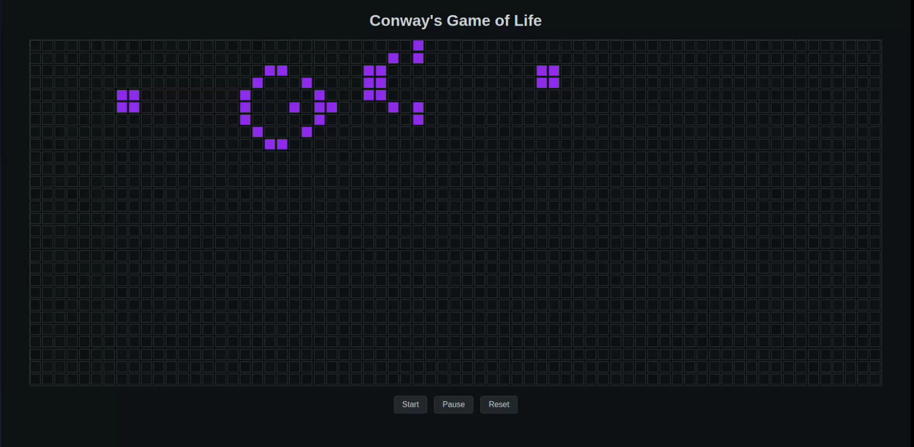

# Conway's Game of Life
A simple implementation of Conway's Game of life using JavaScript.

## Description
Conway's Game of Life is a cellular automaton devised by the British mathematician John Horton Conway in 1970. It's a zero-player game, meaning that its evolution is determined by its initial state, requiring no further input. The game is a classic example of how simple rules can lead to complex behavior.

This is a simple implementation of Conway's Game of Life in Python. The game is played on a 2D grid where each cell can be either alive or dead. The game progresses in steps, where each step is determined by the following rules:

1. Any live cell with fewer than two live neighbours dies, as if by underpopulation/loneliness.
2. Any live cell with two or three live neighbours lives on to the next generation.
3. Any live cell with more than three live neighbours dies, as if by overpopulation.
4. Any dead cell with exactly three live neighbours becomes a live cell, as if by reproduction.
5. Any dead cell with fewer than three live neighbours stays dead.
6. Any dead cell with more than three live neighbors stays dead.

## Demo
The following video shows a demo of the game in action.

